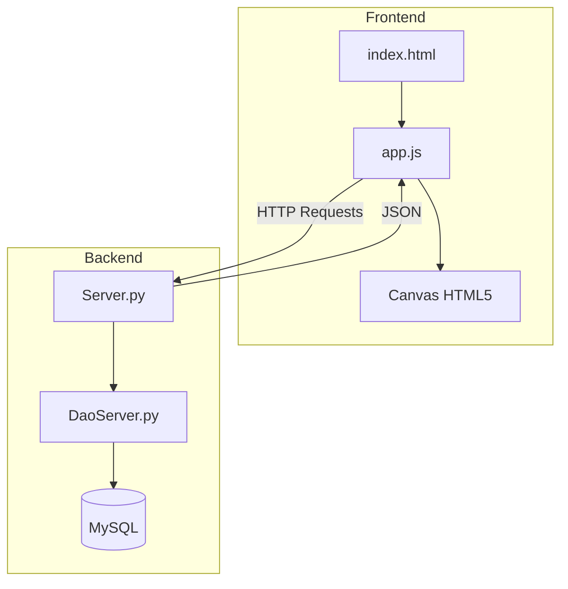

# 🚀 VaporForge - Plataforma Distribuida de Videojuegos 2D

VaporForge es una aplicación web desarrollada como proyecto DAM2 basada en una arquitectura Cliente-Servidor. La plataforma permite a los usuarios registrarse, iniciar sesión y ejecutar videojuegos 2D directamente desde el navegador utilizando HTML5 Canvas.

El proyecto está pensado para funcionar en red local, separando completamente el Frontend, el Backend y la Base de Datos para simular un entorno real de despliegue.

---

# 1- Requisitos Funcionales del Proyecto

## Descripción

La idea principal de VaporForge es crear una pequeña plataforma de videojuegos inspirada en servicios como Steam, pero enfocada en juegos 2D sencillos ejecutados desde el navegador.

Los usuarios pueden acceder al catálogo de juegos e iniciar partidas. Toda la comunicación entre el cliente y el servidor se realiza mediante peticiones HTTP utilizando Flask como API REST.

Además, el proyecto está preparado para funcionar entre diferentes ordenadores de una misma red local, utilizando WSL y MySQL como sistema de persistencia.

---

## Objetivos del Proyecto

- Crear una aplicación basada en arquitectura Cliente-Servidor.
- Separar la lógica del Frontend y el Backend.
- Implementar una API REST funcional con Flask.
- Guardar usuarios, videojuegos  en MySQL.
- Permitir conexiones desde diferentes equipos de la red.
- Integrar videojuegos 2D utilizando Canvas de HTML5.

---

## Actores de la Aplicación

### 1. Usuario / Jugador
Es la persona que utiliza la aplicación.

Puede:
- Registrarse
- Iniciar sesión
- Ver videojuegos
- Ejecutar juegos

---

### 2. Administrador
Se encarga de gestionar el contenido de la plataforma.

Puede:
- Añadir videojuegos
- Modificar información del catálogo

---

### 3. Servidor API
Es el sistema que procesa todas las peticiones del cliente.

Se encarga de:
- Validar usuarios
- Gestionar consultas SQL
- Controlar la base de datos
- Retornar respuestas JSON

---

## Requisitos Funcionales (RF)

### RF-1: Sistema de Login y Registro
La aplicación debe permitir que los usuarios puedan registrarse e iniciar sesión mediante peticiones enviadas al servidor Flask.

El servidor valida las credenciales en MySQL y devuelve una respuesta JSON.

Ejemplo:

```json
{
"coderesponse": "1"
}
```

- `"1"` → Login correcto
- `"0"` → Error en las credenciales


---

## Requisitos No Funcionales (RNF)

### RNF-1: Funcionamiento en Red Local
El Backend se ejecuta dentro de WSL utilizando Flask escuchando en:

```bash
0.0.0.0:5000
```

De esta forma otros equipos de la misma red pueden conectarse al servidor.

---

### RNF-2: Compatibilidad entre Orígenes (CORS)
Como el Frontend y el Backend funcionan en diferentes puertos y ubicaciones, se utiliza la librería:

```python
flask_cors
```

para evitar bloqueos del navegador relacionados con CORS.

---

# 2- Requisitos Técnicos de la Aplicación

## Backend (Servidor y Base de Datos)

Tecnologías utilizadas:

- Python 3
- Flask
- MySQL
- Patrón DAO

Estructura principal:

```bash
/Server
│
├── Server.py
├── DaoServer.py
└── steam.sql
```

### Funciones principales del Backend

- Gestión de usuarios
- Login y registro
- Conexión con MySQL
- Gestión de videojuegos
- Respuestas JSON

---

## FrontEnd

Tecnologías utilizadas:

- HTML5
- CSS3
- JavaScript Vanilla
- Canvas HTML5

Características:

- Interfaz SPA
- Peticiones Fetch API
- Async/Await
- Motor gráfico 2D

Estructura:

```bash
/Client
│
├── index.html
├── styles.css
└── app.js
```

---

# 3- Diagrama de Arquitectura de la Aplicación

## Arquitectura Cliente-Servidor



---

## Modelo E/R y Base de Datos

### Tabla User

| Campo | Tipo |
|---|---|
| id | INT |
| username | VARCHAR |
| password | VARCHAR |

---

### Tabla Game

| Campo | Tipo |
|---|---|
| id | INT |
| title | VARCHAR |
| description | TEXT |
| price | DECIMAL |

---

### Tabla Library

Relaciona usuarios con videojuegos.

| Campo |
|---|
| user_id |
| game_id |

---

### Tabla Achievement

| Campo | Tipo |
|---|---|
| id | INT |
| game_id | INT |
| title | VARCHAR |
| description | TEXT |
| xp_points | INT |

---

### Tabla User_Achievement

| Campo |
|---|
| user_id |
| achievement_id |
| unlocked_at |

---

# 4- Tablero Kanban en GitHub

| ID | Tarea | Responsable | Estado |
|---|---|---|---|
| T1 | Crear base de datos MySQL | Kevin | DONE |
| T2 | Configurar servidor en WSL | Kevin | DONE |
| T3 | Diseñar interfaz Frontend | Eduardo | DONE |
| T4 | Crear API REST Flask | Kevin | DONE |
| T5 | Implementar patrón DAO | Kevin | DONE |
| T6 | Integrar login con Fetch API | Eduardo | DONE |
| T7 | Configurar red local y CORS | Kevin | DONE |
| T8 | Documentación del proyecto | Eduardo | DONE |

https://github.com/users/kevin18-07/projects/2/views/1

---

# 5- Arquitectura de Código e Implementación

## Ejecución del Backend

```bash
cd Server
python Server.py
```

Servidor disponible en:

```bash
http://0.0.0.0:5000
```

---

## Ejecución del Frontend

Abrir el archivo:

```bash
/Client/index.html
```

desde el navegador.

---

## Ejemplo de petición Fetch

```javascript
const response = await fetch("http://192.168.1.10:5000/login", {
method: "POST",
headers: {
"Content-Type": "application/json"
},
body: JSON.stringify({
username: "eduardo",
password: "1234"
})
});

const data = await response.json();
console.log(data);
```

---

## Ejemplo de respuesta JSON

```json
{
"coderesponse": "1",
"message": "Login successful"
}
```

---

# 👨‍💻 Desarrolladores

- Eduardo → Frontend, Canvas y documentación
- Kevin → Backend, API REST y Base de Datos